.. -*- coding: utf-8 -*-

===============================
Un module d'annuaire pour Plone
===============================

La suite `collective.contact.*` est constituée de plusieurs modules permettant de créer et de gérer un annuaire dans un portail Plone. Ce document donne un aperçu des principales fonctionnalités fournies par cette suite.

.. add toctree ?

Créer un annuaire pour votre portail
====================================

Un site Plone peut contenir un et un seul annuaire. Cet annuaire est destiné à contenir des organisations, fonctions, personnes et contacts.
L'annuaire décrit les types d'organisation, les niveaux d'organisation et les types de fonctions pouvant être représentées.

Pour créer un annuaire, il suffit d'ajouter un contenu "Annuaire" dans votre site Plone et de remplir les champs comme suit :

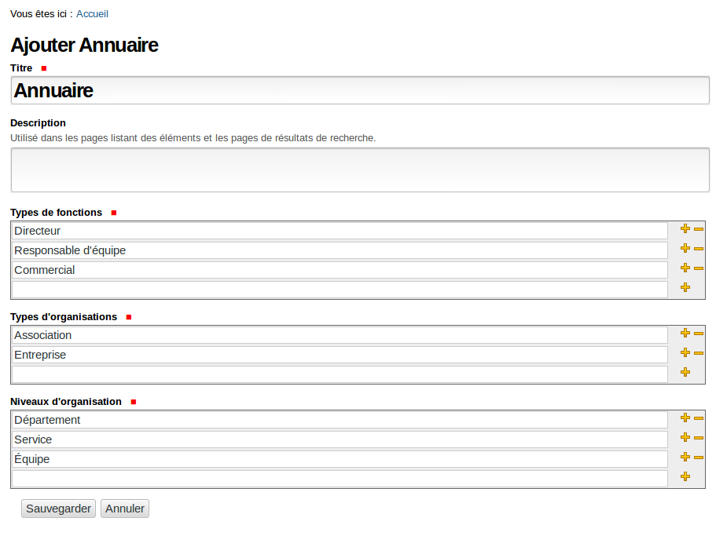

Ajouter une personne dans l'annuaire
====================================

On peut alors ajouter une personne dans l'annuaire :

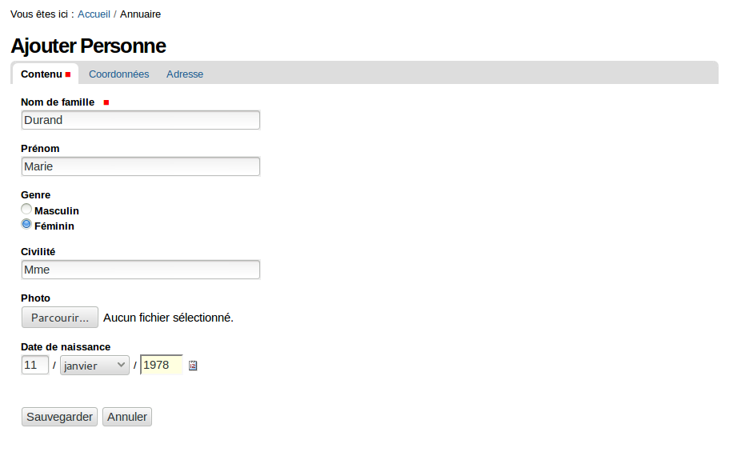

Comme nous le verrons plus tard, une personne peut occuper une ou plusieurs fonctions dans une ou plusieurs organisations.

Ajouter une organisation dans l'annuaire
========================================

Tout d'abord, ajoutons l'organisation Dorémi de type entreprise dans l'annuaire :

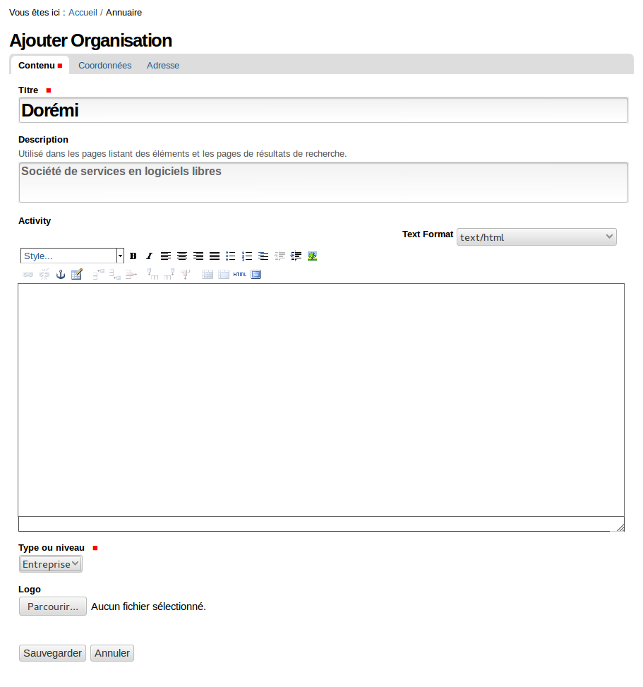

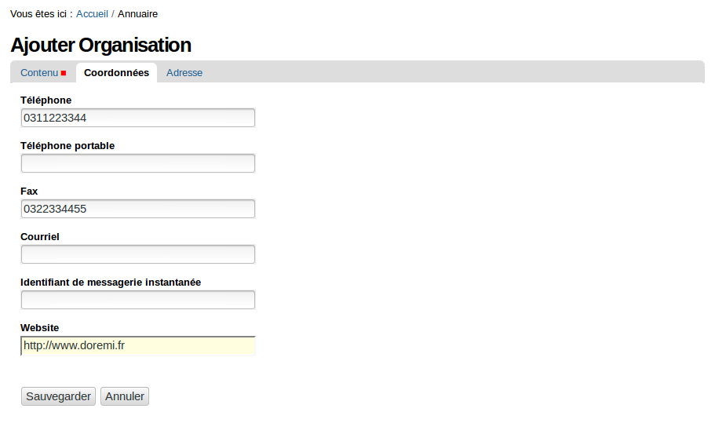

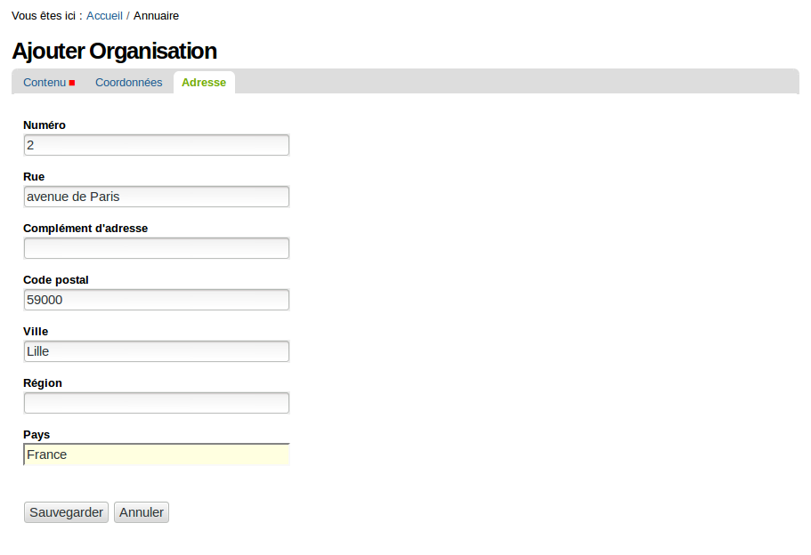

L'adresse de l'entreprise sera utilisée comme adresse par défaut pour toutes les organisations et toutes les fonctions qui seront ajoutées dans celle-ci.

Ajouter une fonction dans une organisation
==========================================

Nous pouvons maintenant ajouter une fonction "Président directeur général" pour cette société :

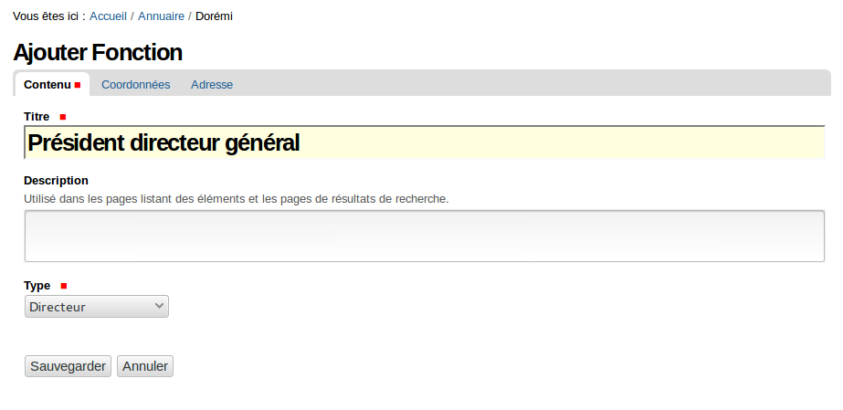

On retrouve l'adresse saisie pour l'entreprise :

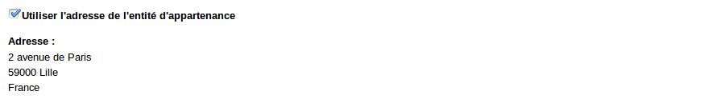

Il reste toutefois possible d'attribuer une adresse différente à la fonction en décochant "Utiliser l'adresse de l'entité d'appartenance" :

Associer une personne à une fonction
====================================

Sur la fiche de cette fonction, un lien permet de créer un contact associé à cette fonction :

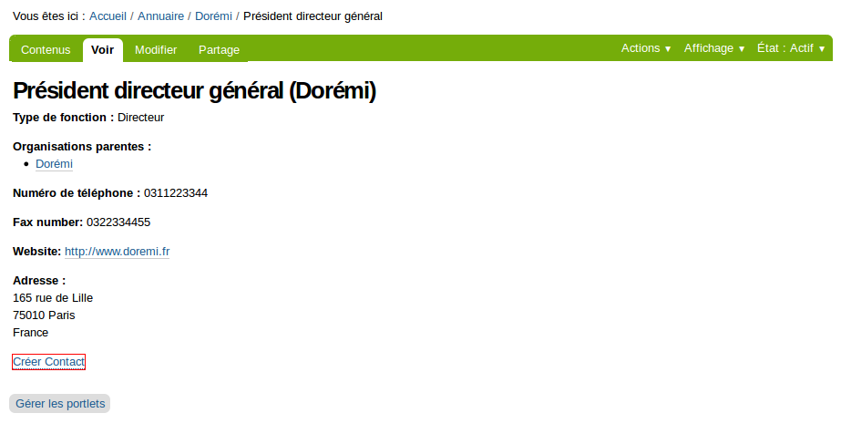

Les champs "Organisation" et "Fonction" sont préremplis dans le formulaire d'ajout du contact :

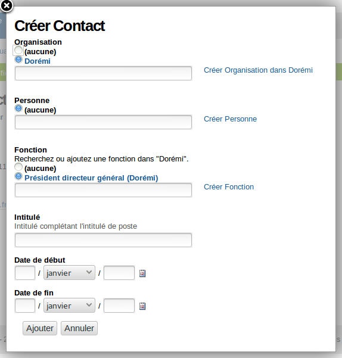

Au survol d'une organisation, une "tooltip" permet d'avoir un aperçu des informations la concernant :

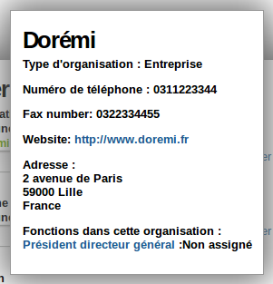

Nous pouvons alors associer une personne déjà présente dans l'annuaire à cette fonction à l'aide d'un champ autocomplété :

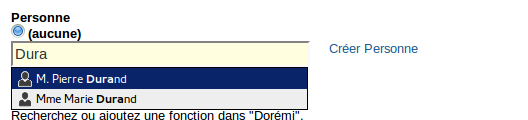

Ou créer une nouvelle personne (sans perdre les informations préremplies (organisation et fonction) pour le contact) :

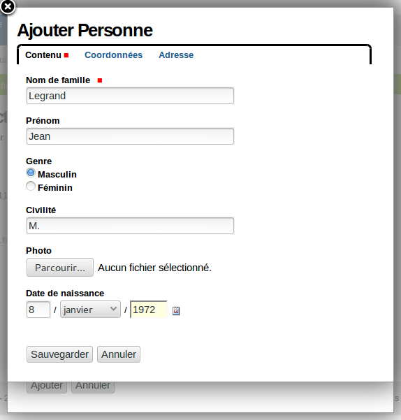

La personne créée via ce formulaire est automatiquement sélectionnée pour le champ "Personne" du formulaire d'ajout de contact :

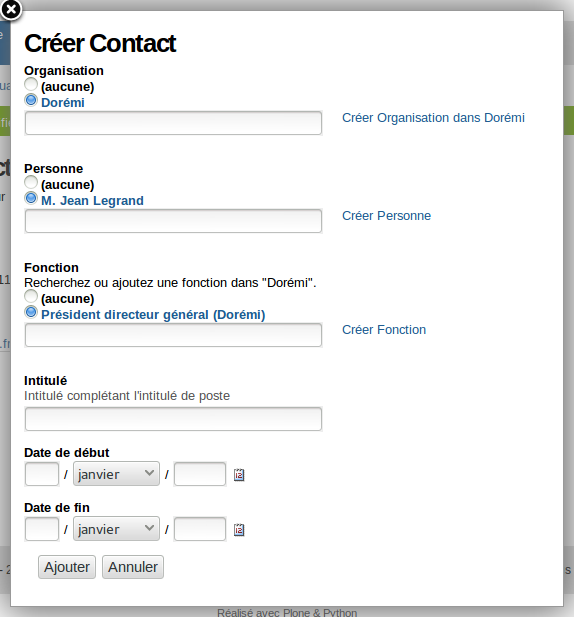

Le contact est créé et nous pouvons aller sur sa fiche afin de télécharger sa vcard (vcard est un standard qui permet de représenter les informations de contact) :

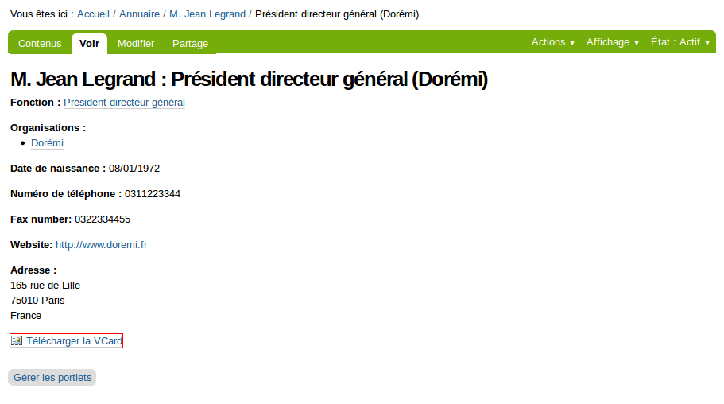

.. todo? ./images/vcard.png

Sous-organisations
==================

Créons l'organigramme de cette société. Il s'agit d'une PME comprenant deux équipes :

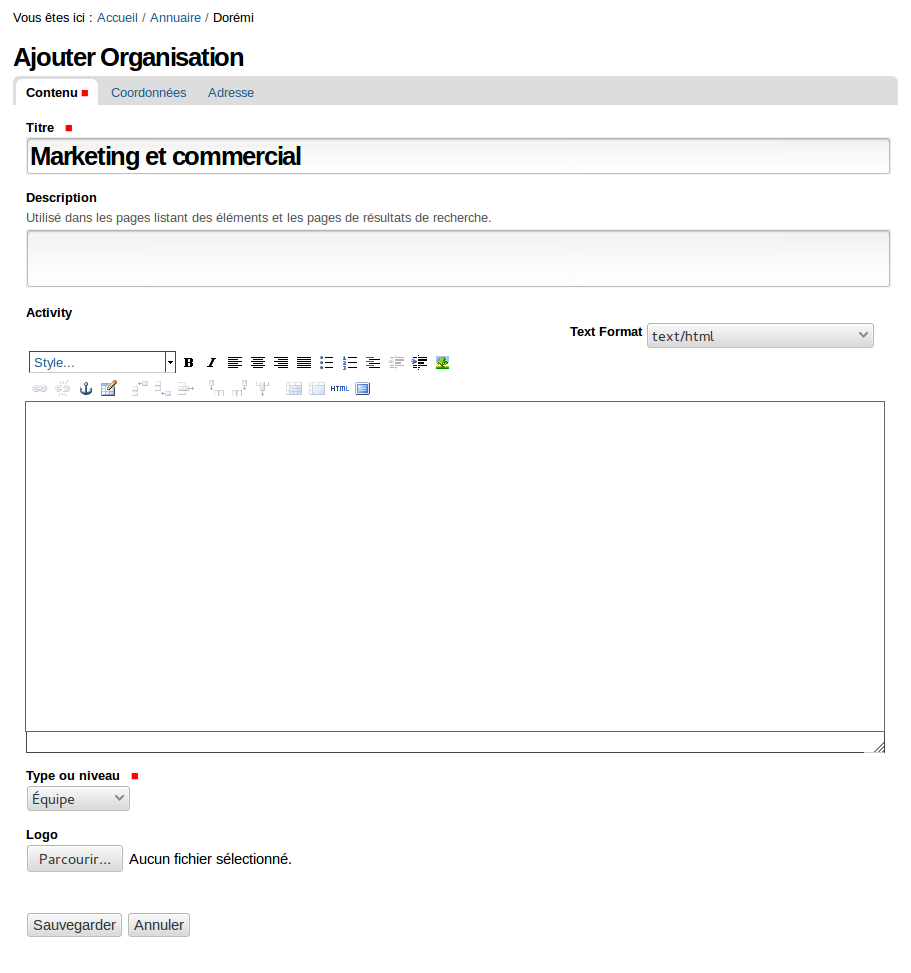

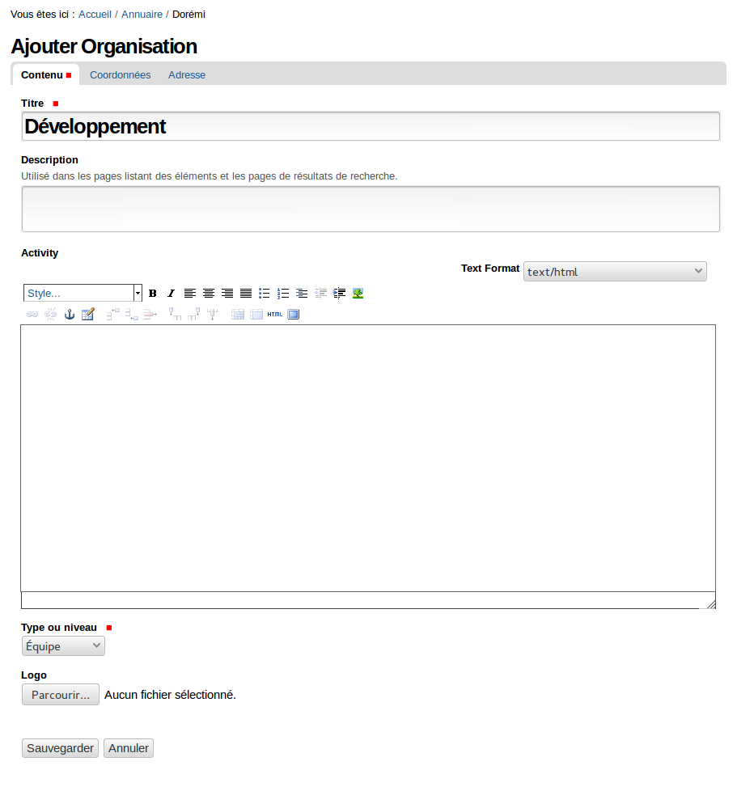

Tout comme la fonction PDG, les équipes héritent de l'adresse de l'organisation par défaut :

Nous pouvons désormais continuer à détailler l'organigramme de Dorémi en ajoutant des fonctions dans les équipes, en créant d'autres niveaux d'organisation ou même créer d'autres organisations (associations, entreprises, ...) à la racine de l'annuaire.

La fiche de l'organisation permet d'avoir une vue synthétique de l'organigramme :

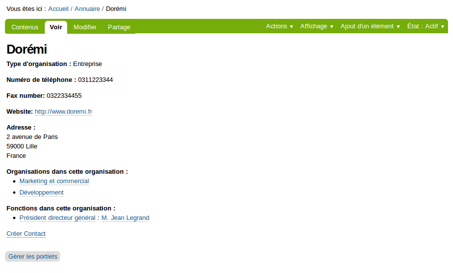
